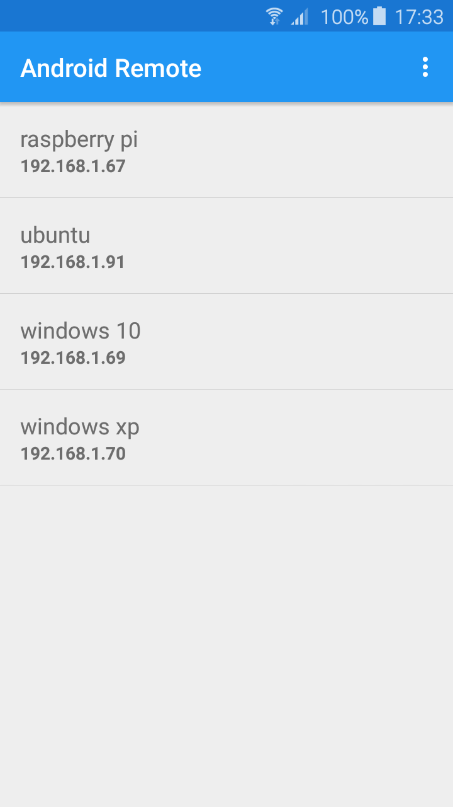
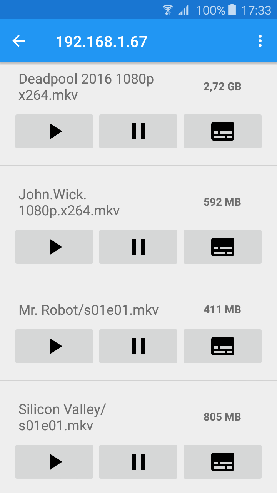

# Remote Player

## About
This project allows for any computer with any video player and operating system to be controlled remotely.

There is one folder for the remote player server with a console based client and other folder for the Android client.

The App has two screens, one to search devices (udp broadcast) and the other displays files and video player options.

### Supported Systems
- Linux
- Windows
- Mac

### Supported Video Players
- VLC
- OMXPlayer (Raspberry Pi)

More players can be added easily.

### Features
- List servers on the network using UDP broadcast
- List files (ignores .srt)
- Play video
- Pause and resume video
- Toggle subtitles
- Quit video player
- Shutdown computer

## Usage
### Compile
	cd RemotePlayer
    mvn clean package

### Running
#### Server
    java -cp ./target/remoteplayer-1.0-SNAPSHOT.jar com.briefbytes.remoteplayer.Main config.txt

#### Client
    java -cp ./target/remoteplayer-1.0-SNAPSHOT.jar com.briefbytes.remoteplayer.client.ClientUI

Edit the config file to match your requirements and make sure you can start the video player from the command line.
Run the server on startup, connect your device to a monitor/television and you got yourself a small htpc.

## Images

List devices                               | List files
------------------------------------------ | ------------------------
 | 
